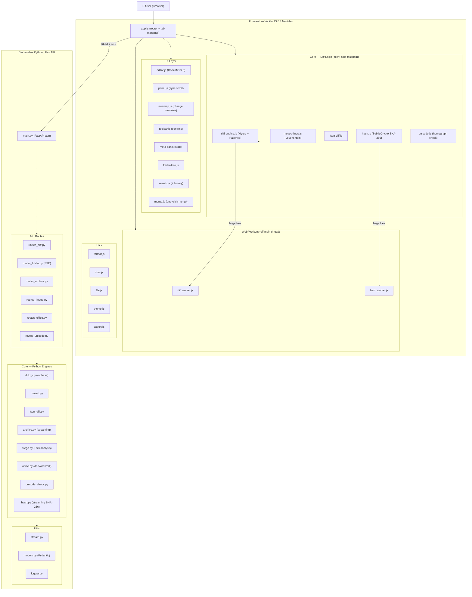
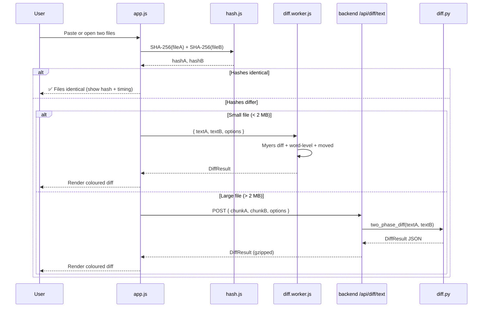
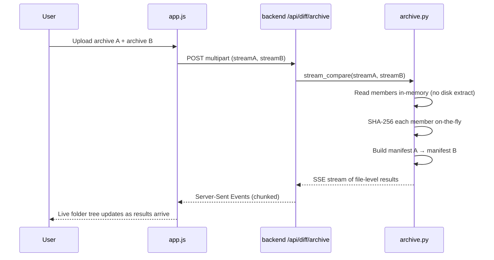
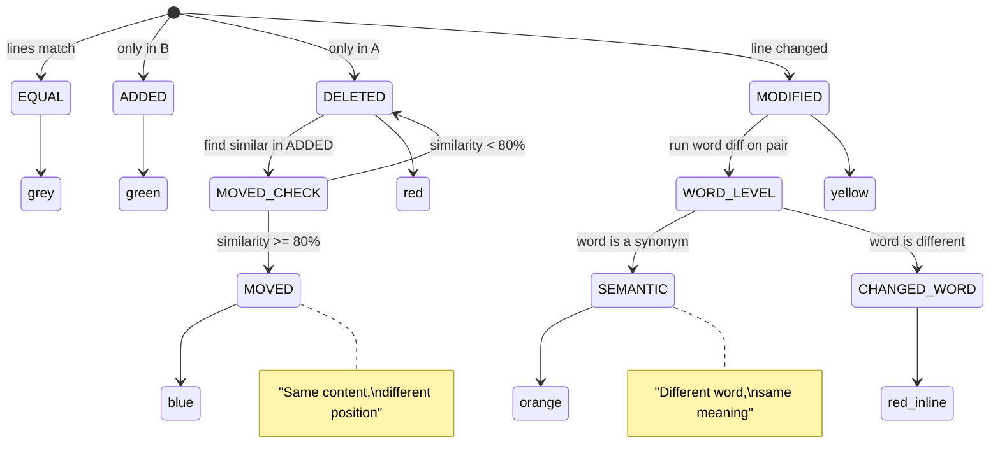
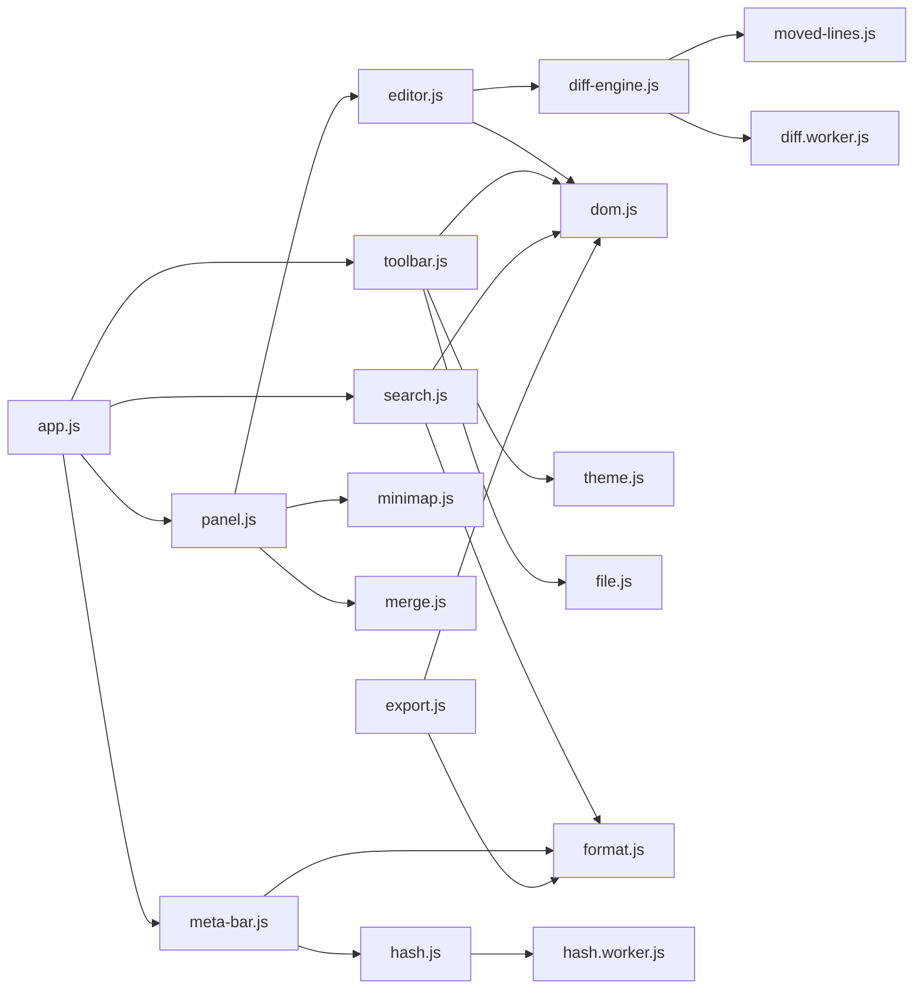
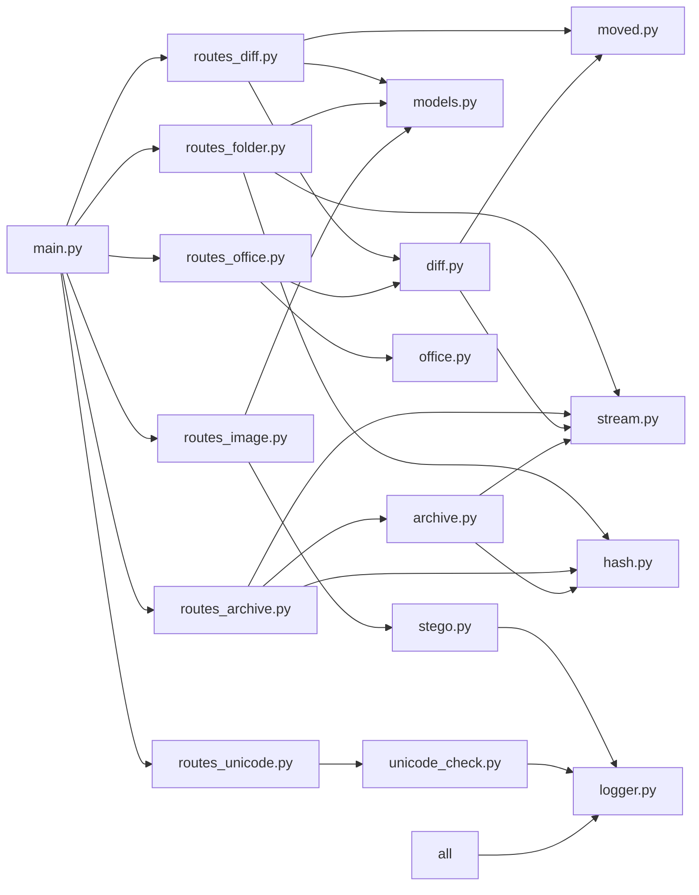

# Diffinity — Architecture

## System Overview

---

## Data Flow — Text Comparison

---

## Data Flow — Archive Comparison

---

## Diff Colour State Machine

---

## Module Dependency Graph (Frontend)

---

## Backend Module Dependency Graph

